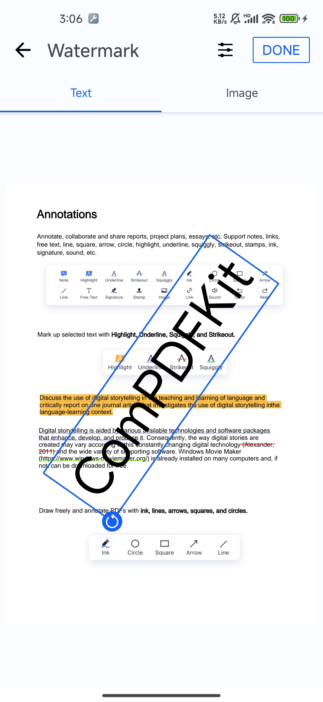

# ComPDFKit SDK Tools

## Overview
The `ComPDFKit_Tools` module is an integrated part of the `ComPDFKit SDK`, offering a complete set of common PDF functionalities for quick PDF viewing and editing. If the interface provided by the `ComPDFKit_Tools` module does not meet your product requirements, you can also integrate the `ComPDFKit SDK` yourself to achieve the desired UI. Please note that the functionalities presented by this module do not represent all the capabilities of the `ComPDFKit SDK`. If you cannot find the feature you need, please contact our sales team.


## Add the ComPDFKit PDF SDK Package

In addition to the `ComPDFKit_Tools` module source code, we also provide a Gradle-based integration option. To ensure compatibility, please make sure the tools module version matches the `ComPDFKit SDK` version.

```diff
dependencies {
  implementation 'com.compdf:compdfkit:2.2.1'
  implementation 'com.compdf:compdfkit-ui:2.2.1'
+  implementation 'com.compdf:compdfkit-tools:2.2.1'
}
```

## Usage

The ComPDFKit_Tools module provides two main components: [CPDFDocumentActivity](./src/main/java/com/compdfkit/tools/common/pdf/CPDFDocumentActivity.java) and [CPDFDocumentFragment.java](./src/main/java/com/compdfkit/tools/common/pdf/CPDFDocumentFragment.java). These components enable you to easily implement PDF functionalities.

### CPDFDocumentActivity

Use CPDFDocumentActivity to display a PDF document:
```java
CPDFConfiguration configuration = CPDFConfigurationUtils.normalConfig(fragment.getContext(), "tools_default_configuration.json");

// Example 1:
CPDFDocumentActivity.startActivity(context, uri, password, configuration);

// Example 2:
CPDFDocumentActivity.startActivity(context, filePath, password, configuration);
```

### CPDFDocumentFragment

Use CPDFDocumentFragment to load a PDF document into a Fragment:
```java
CPDFConfiguration configuration = CPDFConfigurationUtils.normalConfig(fragment.getContext(), "tools_default_configuration.json");

// Example 1:
CPDFDocumentFragment documentFragment = CPDFDocumentFragment.newInstance(
  filePath,
  password,
  configuration);

// Example 2:
CPDFDocumentFragment documentFragment = CPDFDocumentFragment.newInstance(
  uri,
  password,
  configuration);
```

### Watermark

If you only need to use the watermark function, you can use `CWatermarkEditDialog` alone. The following is an example of use:

```java
// The example uses the sample document located in the assets directory
String path = CFileUtils.getAssetsTempFile(this, "test.pdf", "test.pdf");
CWatermarkEditDialog editDialog = CWatermarkEditDialog.newInstance();
// You can pass the file path or URI of the PDF document directly
editDialog.setDocument(path, null);
// Or pass an existing CPDFDocument object
// editDialog.setDocument(document);
editDialog.setPageIndex(0);
// Set the saving path of the document with watermark added. If not set, when you click [Save],
// a file directory selection pop-up window will pop up for saving.
File saveFile = new File(getFilesDir(), "temp/test.pdf");
editDialog.setSavePath(saveFile.getAbsolutePath());
editDialog.setDefaultText("ComPDFKit");
// editDialog.setDefaultImagePath("xxx.png");
editDialog.setCompleteListener(pdfFile -> {
  if (!TextUtils.isEmpty(pdfFile)){
    openPDF(pdfFile);
  }
  editDialog.dismiss();
});
editDialog.show(getSupportFragmentManager(), "addWatermarkDialog");

private void openPDF(String path){
  CPDFDocumentActivity.startActivity(this, path, "",
                                     CPDFConfigurationUtils.normalConfig(this, "tools_default_configuration.json"));
}
```



### Encryption

If you need to set an opening password or permission password for a document, you can do so through `CDocumentEncryptionDialog`. The following is an example:

```java
private void encryption(){
  String path = CFileUtils.getAssetsTempFile(this, "test_SetPassword.pdf", "test_SetPassword.pdf");

  CPDFDocument document = new CPDFDocument(this);
  document.open(path);

  CPDFDocument.PDFDocumentPermissions permission = document.getPermissions();
  //only has user permission
  if (permission == CPDFDocument.PDFDocumentPermissions.PDFDocumentPermissionsUser) {
    // You can enter the owner permissions password and reload the pdf to gain owner permissions
    CInputOwnerPwdDialog inputOwnerPwdDialog = CInputOwnerPwdDialog.newInstance();
    inputOwnerPwdDialog.setDocument(document);
    inputOwnerPwdDialog.setConfirmClickListener(ownerPassword -> {
      inputOwnerPwdDialog.dismiss();
      document.reload(ownerPassword);
      showEncryptionDialog(document);
    });
    inputOwnerPwdDialog.show(getSupportFragmentManager(), "inputOwnerPwdDialog");
    return;
  }
  showEncryptionDialog(document);
}

private void showEncryptionDialog(CPDFDocument document){
  CDocumentEncryptionDialog encryptionDialog = CDocumentEncryptionDialog.newInstance();
  encryptionDialog.setDocument(document);
  encryptionDialog.setEncryptionResultListener((isRemoveSecurity, result, filePath, password) -> openPDF(filePath));
  encryptionDialog.show(getSupportFragmentManager(), "showEncryptionDialog");
}

private void openPDF(String path){
  CPDFDocumentActivity.startActivity(this, path, "",
                                     CPDFConfigurationUtils.normalConfig(this, "tools_default_configuration.json"));
}
```


