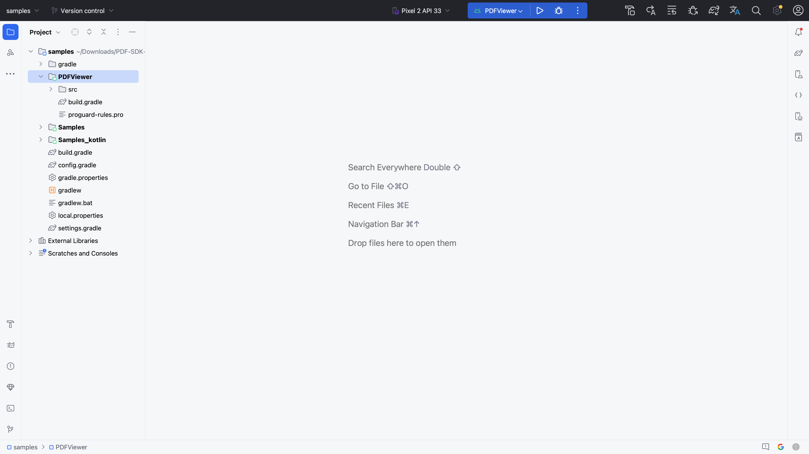
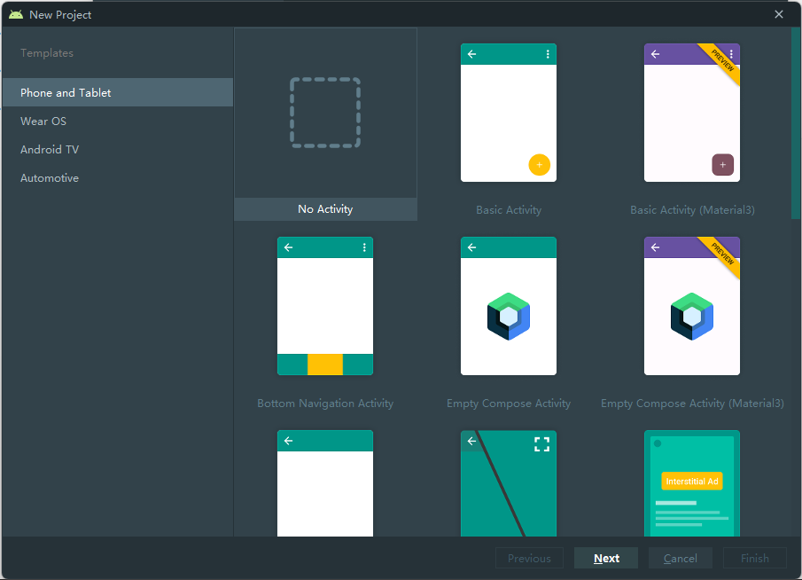
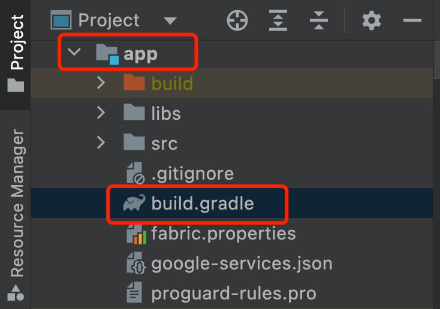
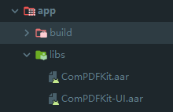
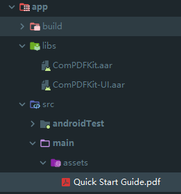
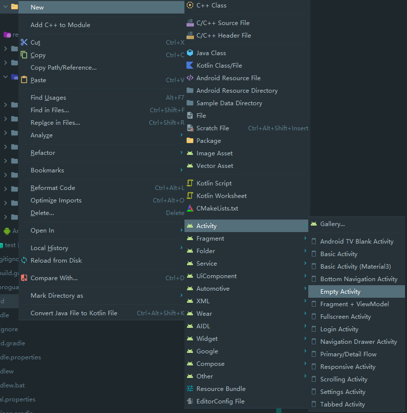
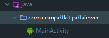
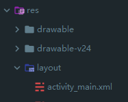
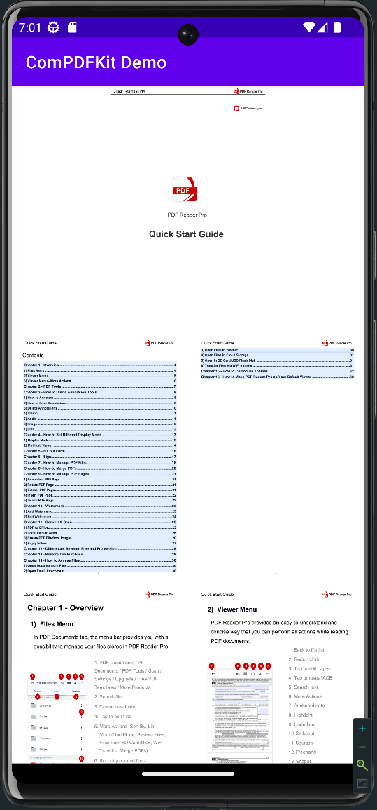

# Introduction

[ComPDFKit](https://www.compdf.com/) PDF SDK is a powerful PDF library for developers to add robust PDF functionality to their applications, which ships with simple-to-use Java APIs to offer document viewing, creation, searching, annotation, and editing. With this SDK, even developers with limited knowledge of PDF can quickly build a professional PDF viewer with just a few lines of code on the Android platform.

[ComPDFKit API](https://api.compdf.com/api/pricing) allows you to get 1000 files processing monthly now! Just [sign up](https://api.compdf.com/signup) for a free trial and enjoy comprehensive PDF functions.


# Related

- [ComPDFKit PDF Library for iOS](https://github.com/ComPDFKit/PDF-SDK-iOS)

- ComPDFKit PDF SDK - [Flutter Library](https://pub.dev/packages/compdfkit_flutter)

- ComPDFKit PDF SDK - [React Native Library](https://www.compdf.com/react-native)

- [How to Build an Android PDF Viewer or Editor in Kotlin](https://www.compdf.com/blog/build-an-android-pdf-viewer-or-editor-in-kotlin)


# Get Started

[ComPDFKit SDK for Android](https://www.compdf.com/android) is a [powerful PDF SDK](https://www.compdf.com/pdf-sdk) that is easy to be embedded in any Android application with a few lines of Java code. The following sections introduce the requirements, the structure of the installation package, and how to make an Android PDF Reader in Java with ComPDFKit PDF SDK. Now, start to take a few minutes to build your Android PDF Viewer.


## Requirements

[ComPDFKit Android PDF SDK](https://www.compdf.com/guides/pdf-sdk/android/overview) supports Android devices running API level 19 or newer and targets the latest stable Android 4.4 or later. In addition, it requires applications to be built with Java 8 language features enabled.

- Android Studio 3.2 or newer (support AndroidX).
- Project specifications.
    - A `minSdkVersion` of `19` or higher.  
    - A `compileSdkVersion` of `30` or higher.  
    - A `targetSdkVersion` of `30` or higher.  
    - Android ABI(s): x86, x86_64, armeabi-v7a, arm64-v8a.

## How to Run a Demo

ComPDFKit PDF SDK for Android provides multiple demos in Java for developers to learn how to call the SDK on Android. You can find them in the ***"Samples"*** folder. In this guide, we take ***"PDFViewer"*** as an example to show how to run it on Android.

1. Import the ***"Samples"*** project on Android Studio.
2. In the toolbar, select ***"PDFViewer"*** from the run configurations drop-down menu.
3. From the target device drop-down menu, select the device that you want to run ***"PDFViewer"*** on.

4. Click **Run**.

If you don't have any devices configured, then you need to either connect a device via USB or create an AVD to use the Android Emulator.



**Note:** *This is a demo project, presenting completed [ComPDFKit PDF SDK](https://compdf.com/pdf-sdk/) functions. The functions might be different based on the license you have purchased. Please check that the functions you choose work fine in this demo project.*


## How to Make an Android PDF Viewer in Java

This section will help you quickly get started with ComPDFKit PDF SDK to make an Android app in Java with step-by-step instructions. Through the following steps, you will get a simple application that can display the contents of a specified PDF file.


### Create a New Project

1. Use Android Studio to create a Phone & Tablet project. Here we create a **No Activity** project.




### Installation

#### Integrate With Gradle

1. Open the `settings.gradle` file located in your project's root directory and add the `mavenCentral` repository:

```diff
dependencyResolutionManagement {
    repositoriesMode.set(RepositoriesMode.FAIL_ON_PROJECT_REPOS)
    repositories {
        google()
+       mavenCentral()
    }
}
```

2. Open the `build.gradle` file in the application module directory:



Edit it and add the complete `ComPDFKit SDK` dependency:

```groovy
dependencies {
  implementation 'com.compdf:compdfkit:2.1.0'
  implementation 'com.compdf:compdfkit-ui:2.1.0'
}
```

3. Apply for read and write permissions in `AndroidManifest.xml`:

```xml
<uses-permission android:name="android.permission.WRITE_EXTERNAL_STORAGE"/>
<uses-permission android:name="android.permission.READ_EXTERNAL_STORAGE"/>
```

**Note:** *On your apps that target Android 6.0 or higher, make sure to check for and request read and write permissions to external storage at runtime.*

4. If you use an online license, please add network access permissions in `AndroidManifest.xml`:

```xml
<uses-permission android:name="android.permission.INTERNET"/>
```


#### Integrate Manually

1. Copy ***"ComPDFKit.aar"*** and ***"ComPDFKit-UI.aar"*** to the ***"libs"*** directory of the **app**.



2. Add the following code into the **app** dictionary's ***"build.gradle"*** file:

```groovy
...
dependencies {
    /*ComPDFKit SDK*/
    implementation(fileTree('libs'))
    ...
}
...
```

3. Add [ComPDFKit PDF SDK for Android](https://www.compdf.com/blog/compdfkit-for-android) as a dependency to the project. Inside the **app** dictionary's ***"build.gradle"***, add ***"ComPDFKit.aar"***, ***"ComPDFKit-UI.aar"***, and the related support libraries to the `dependencies`. For simplicity, update the dependencies as follows:


```groovy
dependencies {
    ...
    //glide
    implementation 'com.github.bumptech.glide:glide:4.12.0'
    annotationProcessor 'com.github.bumptech.glide:compiler:4.12.0'

    implementation 'androidx.documentfile:documentfile:1.0.1'
}
```

4. Apply for read and write permissions in `AndroidManifest.xml`:

```xml
<uses-permission android:name="android.permission.WRITE_EXTERNAL_STORAGE"/>
<uses-permission android:name="android.permission.READ_EXTERNAL_STORAGE"/>
```

**Note:** *On your apps that target Android 6.0 or higher, make sure to check for and request read and write permissions to external storage at runtime.*

5. If you use an online license, please add network access permissions in `AndroidManifest.xml`:

```xml
<uses-permission android:name="android.permission.INTERNET"/>
```


### Apply the License Key


Add this license in the **AndroidManifest.xml** of the main module. In version **1.13.0**, we introduced a brand-new online authentication license scheme for ComPDFKit SDK. By default, the SDK performs online authentication. If you are using a version prior to **1.13.0**, please refer to the following example to configure the SDK for offline authentication mode:<br/>

* **Online license**

```xml
<!-- Each ComPDFKit license is bound to a specific applicationId -->
<!-- For example: com.compdfkit.pdfviewer -->
<meta-data
    android:name="compdfkit_key_online"
    android:value="Your ComPDFKit Key" />
```

You can also initialize ComPDFKit SDK in code using:

```java
CPDFSdk.init(context, "your compdfkit license", false);
```

* **Offline license**

```xml
<!-- Each ComPDFKit license is bound to a specific applicationId -->
<!-- For example: com.compdfkit.pdfviewer -->
<meta-data
    android:name="compdfkit_key"
    android:value="Your ComPDFKit Key" />
```

You can also initialize ComPDFKit SDK in code using:

```java
CPDFSdk.init(context, "your compdfkit license");
```


### Add Proguard Rules

In the `proguard-rules.pro` file, please add the obfuscation configuration information for `compdfkit` as follows:

```
-keep class com.compdfkit.ui.** {*;}
-keep class com.compdfkit.core.** {*;}
```


### Display a PDF Document

1. Copy a PDF document into the **assets** directory of your Android project. For example, import the file ***"Quick Start Guide.pdf"*** to the path **src/main/assets**.




2. Create a new **Empty Activity** under your package, and set the activity name to **MainActivity**.




Android Studio will automatically generate a source file called ***"MainActivity.java"*** and a layout file called ***"activity_main.xml"***.

The source file:



The layout file:



3. Create a `CPDFReaderView` in your ***"activity_main.xml"*** to display the contents of the PDF document:

```xml
<!-- Your activity_main.xml file -->

<?xml version="1.0" encoding="utf-8"?>
<androidx.constraintlayout.widget.ConstraintLayout xmlns:android="http://schemas.android.com/apk/res/android"
    xmlns:app="http://schemas.android.com/apk/res-auto"
    xmlns:tools="http://schemas.android.com/tools"
    android:layout_width="match_parent"
    android:layout_height="match_parent"
    tools:context=".MainActivity">

    <!-- Create a CPDFReaderView -->
    <com.compdfkit.ui.reader.CPDFReaderView
        android:id="@+id/readerview"
        android:layout_width="match_parent"
        android:layout_height="match_parent" />

</androidx.constraintlayout.widget.ConstraintLayout>
```

Get the `CPDFReaderView` from the layout or create a `CPDFReaderView` directly in the code in the corresponding ***MainActivity.java*** file:

```Java
// Your MainActivity.java file

package com.compdfkit.pdfviewer;

import androidx.appcompat.app.AppCompatActivity;

import android.os.Bundle;
import com.compdfkit.ui.reader.CPDFReaderView;

public class MainActivity extends AppCompatActivity {

    @Override
    protected void onCreate(Bundle savedInstanceState) {
        super.onCreate(savedInstanceState);
        setContentView(R.layout.activity_main);

        // Get CPDFReaderView from xml.
        CPDFReaderView readerView = findViewById(R.id.readerview);
        // Code to create CPDFReaderView.
        // CPDFDocument readerView = new CPDFReaderView(content);
    }
}
```
4. Open the document. This is a time-consuming process, so it needs to be executed in a **sub-thread**. After the document is opened successfully, the UI that renders the PDF is initiated:

```Java
// Your MainActivity.java file

... //imports

public class MainActivity extends AppCompatActivity {

    // Copy the PDF file from the assets folder to the cache folder.
    private void copyPdfFromAssetsToCache(String fileName) {
        try {
            InputStream inputStream = getAssets().open(fileName);
            File outputFile = new File(getCacheDir(), fileName);
            FileOutputStream outputStream = new FileOutputStream(outputFile);

            byte[] buffer = new byte[1024];
            int bytesRead;
            while ((bytesRead = inputStream.read(buffer)) != -1) {
                outputStream.write(buffer, 0, bytesRead);
            }

            inputStream.close();
            outputStream.flush();
            outputStream.close();
        } catch (IOException e) {
            e.printStackTrace();
        }
    }
    
    @Override
    protected void onCreate(Bundle savedInstanceState) {
        super.onCreate(savedInstanceState);
        setContentView(R.layout.activity_main);

        CPDFReaderView readerView = findViewById(R.id.readerview);
        // Code to create CPDFReaderView.
        // CPDFDocument readerView = new CPDFReaderView(content);

        //Create a document object.
        CPDFDocument document = new CPDFDocument(this);
        

        new Thread(() -> {
            String fileName = "Quick Start Guide.pdf";
            copyPdfFromAssetsToCache(fileName);

            File file = new File(getCacheDir(), fileName);
            String filePath = file.getAbsolutePath();

            //Open document.
            CPDFDocument.PDFDocumentError error = document.open(filePath);
            if (error == CPDFDocument.PDFDocumentError.PDFDocumentErrorPassword) {
                //The document is encrypted and requires a password to open.
                error = document.open(filePath, "password");
            }

            if (error == CPDFDocument.PDFDocumentError.PDFDocumentErrorSuccess) {
                //The document is opened successfully and data can be parsed and manipulated.
            } else {
                //The PDF file failed to open. You can refer to the API file for specific error
            }
        }).start();
    }
}
```

5. Set the basic properties of `CPDFReaderView` :

```Java
// Your MainActivity.java file

... // imports

public class MainActivity extends AppCompatActivity {
    // Create a handler to run the code on the main thread.
    private Handler mainThreadHandler = new Handler(Looper.getMainLooper());
...
    if (error == CPDFDocument.PDFDocumentError.PDFDocumentErrorSuccess) {
        // The document is opened successfully and data can be parsed and manipulated.
        mainThreadHandler.post(() -> {
            // Set the document content for UI.
            readerView.setPDFDocument(document);
        });
    } else {
        // The PDF file failed to open. You can refer to the API file for specific error
    }
...
}
```

6. Your code may resemble the following at this stage: 

```Java
// Your MainActivity.java file

... // imports

public class MainActivity extends AppCompatActivity {
    // Create a handler to run the code on the main thread.
    private Handler mainThreadHandler = new Handler(Looper.getMainLooper());
    // Copy the PDF file from the assets folder to the cache folder.
    private void copyPdfFromAssetsToCache(String fileName) {
        try {
            InputStream inputStream = getAssets().open(fileName);
            File outputFile = new File(getCacheDir(), fileName);
            FileOutputStream outputStream = new FileOutputStream(outputFile);

            byte[] buffer = new byte[1024];
            int bytesRead;
            while ((bytesRead = inputStream.read(buffer)) != -1) {
                outputStream.write(buffer, 0, bytesRead);
            }

            inputStream.close();
            outputStream.flush();
            outputStream.close();
        } catch (IOException e) {
            e.printStackTrace();
        }
    }

    @Override
    protected void onCreate(Bundle savedInstanceState) {
        super.onCreate(savedInstanceState);
        setContentView(R.layout.activity_main);

        CPDFReaderView readerView = findViewById(R.id.readerview);

        //Create a document object.
        CPDFDocument document = new CPDFDocument(this);

        new Thread(() -> {
            String fileName = "Quick Start Guide.pdf";
            copyPdfFromAssetsToCache(fileName);

            File file = new File(getCacheDir(), fileName);
            String filePath = file.getAbsolutePath();

            //Open document.
            CPDFDocument.PDFDocumentError error = document.open(filePath);
            if (error == CPDFDocument.PDFDocumentError.PDFDocumentErrorPassword) {
                //The document is encrypted and requires a password to open.
                error = document.open(filePath, "password");
            }

            if (error == CPDFDocument.PDFDocumentError.PDFDocumentErrorSuccess) {
                //The document is opened successfully and data can be parsed and manipulated.
                mainThreadHandler.post(() -> {
                    //Set the document to the reader view.
                    readerView.setPDFDocument(document);
                });
            } else {
                //The PDF file failed to open. You can refer to the API file for specific error
            }
        }).start();
    }
}
```

```xml
<!-- Your activity_main.xml file -->
<?xml version="1.0" encoding="utf-8"?>
<androidx.constraintlayout.widget.ConstraintLayout xmlns:android="http://schemas.android.com/apk/res/android"
    xmlns:app="http://schemas.android.com/apk/res-auto"
    xmlns:tools="http://schemas.android.com/tools"
    android:layout_width="match_parent"
    android:layout_height="match_parent"
    tools:context=".MainActivity">

    <com.compdfkit.ui.reader.CPDFReaderView
        android:id="@+id/readerview"
        android:layout_width="match_parent"
        android:layout_height="match_parent" />

</androidx.constraintlayout.widget.ConstraintLayout>
```

7. Run the application.



Now, with the help of ComPDFKit, you can get a simple application to display a PDF file.


# Examples

There are many samples in the [**samples**](./samples) folder that demonstrate the main features of the [ComPDFKit API](https://api.compdf.com/) and how to use them, such as adding watermarks, comments, forms, etc. to PDFs. You can copy the code, add it to your project and run it directly. Or, you can get our [code examples for Android](https://www.compdf.com/guides/pdf-sdk/android/examples). To learn more about the ComPDFKit API, please visit our [API Reference](https://developers.compdf.com/guides/pdf-sdk/android/api-reference/index).

# Support

[ComPDFKit]((https://www.compdf.com)) has a professional R&D team that produces comprehensive technical documentation and guides to help developers. Also, you can get an immediate response when reporting your problems to our support team.

- For detailed information, please visit our [Guides](https://www.compdf.com/guides/pdf-sdk/android/overview) page.

- Stay updated with the latest improvements through our [Changelog](https://www.compdf.com/pdf-sdk/changelog-android).

- For technical assistance, please reach out to our [Technical Support](https://www.compdf.com/support).

- To get more details and an accurate quote, please contact our [Sales Team](https://compdf.com/contact-us).


# License

ComPDFKit PDF SDK supports flexible licensing options, please contact [our sales team](mailto:support@compdf.com) to know more. Each license is only valid for one application ID in development mode.  However, any documents, sample code, or source code distribution from the released package of ComPDFKit PDF SDK to any third party is prohibited.


# Note

We are glad to announce that you can register a ComPDFKit API account for a [free trial](https://api.compdf.com/api/pricing) to process 1000 documents per month for free.

