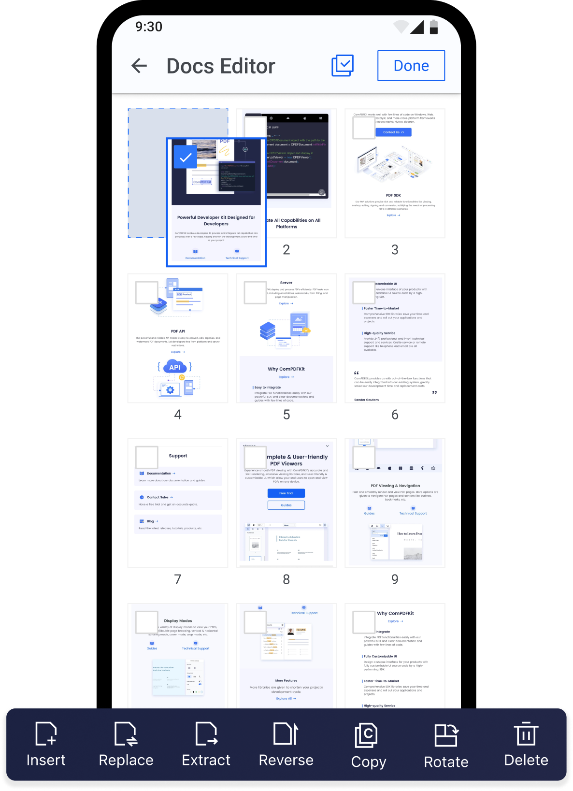
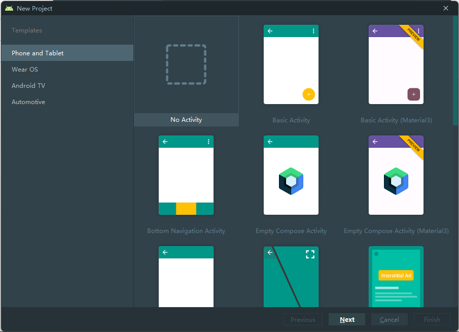
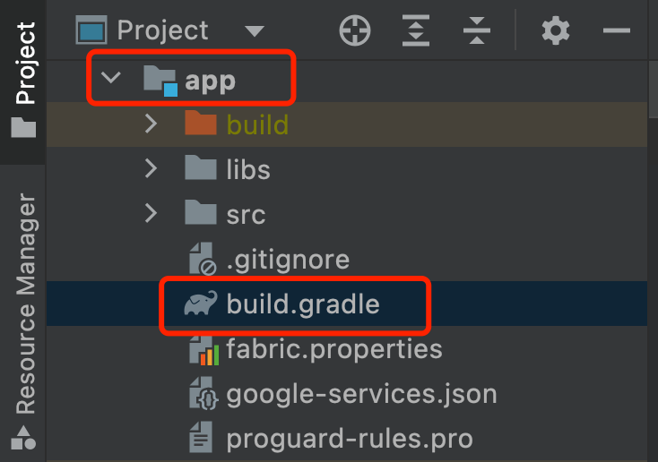

# ComPDF SDK for Android (PDF Library)

As part of the KDAN ecosystem, [ComPDF SDK for Android](https://www.compdf.com/android?utm_source=github_readme_sdk_android&utm_medium=referral&utm_campaign=github_readme_sdk_android) enables developers to quickly and seamlessly integrate advanced PDF functionalities—such as PDF generating  viewing, editing, annotating, and signing—into any Android application.

The ComPDF Android PDF Library provides an easy-to-use Java API that allows direct access to a wide range of PDF features without the need for complex configurations. By [registering for a free ComPDF API account](https://api.compdf.com/signup?utm_source=github_readme_sdk_android&utm_medium=referral&utm_campaign=github_readme_sdk_android), developers can process up to 200+ API calls monthly for free.


[ComPDF SDK](https://www.compdf.com/?utm_source=github_readme_sdk_android&utm_medium=referral&utm_campaign=github_readme_sdk_android) seamlessly operates on [Web](https://www.compdf.com/web?utm_source=github_readme_sdk_android&utm_medium=referral&utm_campaign=github_readme_sdk_android), [Windows](https://www.compdf.com/windows?utm_source=github_readme_sdk_android&utm_medium=referral&utm_campaign=github_readme_sdk_android), [Android](https://www.compdf.com/android?utm_source=github_readme_sdk_android&utm_medium=referral&utm_campaign=github_readme_sdk_android), [iOS](https://www.compdf.com/ios?utm_source=github_readme_sdk_android&utm_medium=referral&utm_campaign=github_readme_sdk_android), [Mac](https://www.compdf.com/contact-sales?utm_source=github_readme_sdk_android&utm_medium=referral&utm_campaign=github_readme_sdk_android), and [Server](https://www.compdf.com/server?utm_source=github_readme_sdk_android&utm_medium=referral&utm_campaign=github_readme_sdk_android), with support for cross-platform frameworks such as [React Native](https://www.compdf.com/react-native?utm_source=github_readme_sdk_android&utm_medium=referral&utm_campaign=github_readme_sdk_android), [Flutter](https://www.compdf.com/flutter?utm_source=github_readme_sdk_android&utm_medium=referral&utm_campaign=github_readme_sdk_android), etc.


If you find ComPDF SDK useful, please consider giving us a ⭐ **Star** on GitHub — it helps us grow and improve! Got questions or ideas? Join the conversation in our [Discussions](https://github.com/ComPDFKit/compdfkit-pdf-sdk-android/discussions).


---

**Why ComPDF SDK for Android?**

- **Easy to Integrate:** Integrate PDF functionalities easily with our powerful SDK and clear documentation and guides with few lines of code.

- **Fully Customizable UI:** Design a unique interface for your products with fully customizable UI source code by a high-performing SDK.

- **[Comprehensive PDF Features:](https://www.compdf.com/pdf-sdk/features-list?utm_source=github_readme_sdk_android&utm_medium=referral&utm_campaign=github_readme_sdk_android)** Supports generation, viewing, annotation, page editing, content editing, conversion, OCR, redaction, signing, forms, parsing, measurement, compression, comparison, color separation, batch processing, and more.

- **Faster Time-to-Market:** Comprehensive SDK libraries save your time and expenses and roll out your applications and projects.

- **High-quality Service:** We provide 24/7 professional one-to-one technical support, including onsite service and remote assistance via phone and email.

---

## Table of Contents

- [Related](#related)
- [Preview](#preview)
- [Requirements](#requirements)
- [How to Make an Android PDF Viewer in Java](#how-to-make-an-android-pdf-viewer-in-java)
  - [Installation](#installation)
- [Changelog](#changelog)
- [Free Trial & License](#free-trial)
- [Support](#support)

## Related

- [ComPDF SDK for Android Documentation Guide](https://www.compdf.com/guides/pdf-sdk/android/overview?utm_source=github_readme_sdk_android&utm_medium=referral&utm_campaign=github_readme_sdk_android)
- [ComPDF SDK for iOS](https://github.com/ComPDFKit/compdfkit-pdf-sdk-ios-swift)
- [How to Build an Android PDF Viewer or Editor in Java](https://www.compdf.com/blog/build-an-android-pdf-viewer-or-editor-in-java?utm_source=github_readme_sdk_android&utm_medium=referral&utm_campaign=github_readme_sdk_android)
- [Code Samples for Android](https://www.compdf.com/guides/pdf-sdk/android/examples?utm_source=github_readme_sdk_android&utm_medium=referral&utm_campaign=github_readme_sdk_android)
- [ComPDF API Reference](https://api.compdf.com/api-reference/overview?utm_source=github_readme_sdk_android&utm_medium=referral&utm_campaign=github_readme_sdk_android)

## Preview

ComPDF SDK for Android delivers a smooth, feature-rich PDF experience on mobile devices.



## Requirements

[ComPDF SDK for Android](https://www.compdf.com/guides/pdf-sdk/android/overview?utm_source=github_readme_sdk_android&utm_medium=referral&utm_campaign=github_readme_sdk_android) supports Android devices running API level 19 or newer and targets the latest stable Android 4.4 or later. In addition, it requires applications to be built with Java 8 language features enabled.

- Android Studio 3.2 or newer (support AndroidX).
- Project specifications:
  - A `minSdkVersion` of `19` or higher.
  - A `compileSdkVersion` of `30` or higher.
  - A `targetSdkVersion` of `34` or higher.
  - Android ABI(s): x86, x86_64, armeabi-v7a, arm64-v8a.

## How to Make an Android PDF Viewer in Java

This section will help you quickly get started with ComPDF SDK to make an Android app in Java with step-by-step instructions. Through the following steps, you will get a simple application that can display the contents of a specified PDF file.

### Video Guide: Build an Android PDF Editor in Java [](https://youtu.be/SgBidb_eYjA?si=_UX7oECMc7NvC_nv)

### Create a New Project

1. Use Android Studio to create a Phone & Tablet project. Here we create a **No Activity** project.



### Installation

#### Integrate With Gradle

1. Open the `settings.gradle` file located in your project's root directory and add the `mavenCentral` repository:

```diff
dependencyResolutionManagement {
    repositoriesMode.set(RepositoriesMode.FAIL_ON_PROJECT_REPOS)
    repositories {
        google()
+       mavenCentral()
    }
}
```

2. Open the `build.gradle` file in the application module directory:



Edit it and add the complete `ComPDF SDK` dependency:

```groovy
dependencies {
  implementation 'com.compdf:compdfkit:2.6.1'
  implementation 'com.compdf:compdfkit-ui:2.6.1'
}
```

3. Apply for read and write permissions in `AndroidManifest.xml`:

```xml
<uses-permission android:name="android.permission.WRITE_EXTERNAL_STORAGE"/>
<uses-permission android:name="android.permission.READ_EXTERNAL_STORAGE"/>
```

**Note:** *On your apps that target Android 6.0 or higher, make sure to check for and request read and write permissions to external storage at runtime.*

4. If you use an online license, please add network access permissions in `AndroidManifest.xml`:

```xml
<uses-permission android:name="android.permission.INTERNET"/>
```

#### Integrate Manually

1. Copy ***"ComPDFKit.aar"*** and ***"ComPDFKit-UI.aar"*** to the ***"libs"*** directory of the **app**.


2. Add the following code into the **app** dictionary's ***"build.gradle"*** file:

```groovy
...
dependencies {
    /*ComPDF SDK*/
    implementation(fileTree('libs'))
    ...
}
...
```

3. Add [ComPDF SDK for Android](https://www.compdf.com/android?utm_source=github_readme_sdk_android&utm_medium=referral&utm_campaign=github_readme_sdk_android) as a dependency to the project. Inside the **app** dictionary's ***"build.gradle"***, add ***"ComPDFKit.aar"***, ***"ComPDFKit-UI.aar"***, and the related support libraries to the `dependencies`. For simplicity, update the dependencies as follows:

```groovy
dependencies {
    ...
    //glide
    implementation 'com.github.bumptech.glide:glide:4.12.0'
    annotationProcessor 'com.github.bumptech.glide:compiler:4.12.0'

    implementation 'androidx.documentfile:documentfile:1.0.1'
}
```

4. Apply for read and write permissions in `AndroidManifest.xml`:

```xml
<uses-permission android:name="android.permission.WRITE_EXTERNAL_STORAGE"/>
<uses-permission android:name="android.permission.READ_EXTERNAL_STORAGE"/>
```

**Note:** *On your apps that target Android 6.0 or higher, make sure to check for and request read and write permissions to external storage at runtime.*

5. If you use an online license, please add network access permissions in `AndroidManifest.xml`:

```xml
<uses-permission android:name="android.permission.INTERNET"/>
```

### Apply the License Key

Add this license in the **AndroidManifest.xml** of the main module. In version **1.13.0**, we introduced a brand-new online authentication license scheme for ComPDF SDK. By default, the SDK performs online authentication. If you are using a version prior to **1.13.0**, please refer to the following example to configure the SDK for offline authentication mode:<br/>

* **Online license**

```xml
<!-- Each ComPDF license is bound to a specific applicationId -->
<!-- For example: com.compdfkit.pdfviewer -->
<meta-data
    android:name="compdfkit_key_online"
    android:value="Your ComPDF Key" />
```

You can also initialize ComPDF SDK in code using:

```java
CPDFSdk.init(context, "your compdfkit license", false);
```

* **Offline license**

```xml
<!-- Each ComPDF license is bound to a specific applicationId -->
<!-- For example: com.compdfkit.pdfviewer -->
<meta-data
    android:name="compdfkit_key"
    android:value="Your ComPDF Key" />
```

You can also initialize ComPDF SDK in code using:

```java
CPDFSdk.init(context, "your compdfkit license");
```

### Add Proguard Rules

In the `proguard-rules.pro` file, please add the obfuscation configuration information for `compdfkit` as follows:

```
-keep class com.compdfkit.ui.** {*;}
-keep class com.compdfkit.core.** {*;}
```

### Display a PDF Document

1. Copy a PDF document into the **assets** directory of your Android project. For example, import the file ***"Quick Start Guide.pdf"*** to the path **src/main/assets**.


2. Create a new **Empty Activity** under your package, and set the activity name to **MainActivity**.


Android Studio will automatically generate a source file called ***"MainActivity.java"*** and a layout file called ***"activity_main.xml"***.

The source file:


The layout file:


3. Create a `CPDFReaderView` in your ***"activity_main.xml"*** to display the contents of the PDF document:

```xml
<!-- Your activity_main.xml file -->

<?xml version="1.0" encoding="utf-8"?>
<androidx.constraintlayout.widget.ConstraintLayout xmlns:android="http://schemas.android.com/apk/res/android"
    xmlns:app="http://schemas.android.com/apk/res-auto"
    xmlns:tools="http://schemas.android.com/tools"
    android:layout_width="match_parent"
    android:layout_height="match_parent"
    tools:context=".MainActivity">

    <!-- Create a CPDFReaderView -->
    <com.compdfkit.ui.reader.CPDFReaderView
        android:id="@+id/readerview"
        android:layout_width="match_parent"
        android:layout_height="match_parent" />

</androidx.constraintlayout.widget.ConstraintLayout>
```

Get the `CPDFReaderView` from the layout or create a `CPDFReaderView` directly in the code in the corresponding ***MainActivity.java*** file:

```Java
// Your MainActivity.java file

package com.compdfkit.pdfviewer;

import androidx.appcompat.app.AppCompatActivity;

import android.os.Bundle;
import com.compdfkit.ui.reader.CPDFReaderView;

public class MainActivity extends AppCompatActivity {

    @Override
    protected void onCreate(Bundle savedInstanceState) {
        super.onCreate(savedInstanceState);
        setContentView(R.layout.activity_main);

        // Get CPDFReaderView from xml.
        CPDFReaderView readerView = findViewById(R.id.readerview);
        // Code to create CPDFReaderView.
        // CPDFDocument readerView = new CPDFReaderView(content);
    }
}
```

4. Open the document. This is a time-consuming process, so it needs to be executed in a **sub-thread**. After the document is opened successfully, the UI that renders the PDF is initiated:

```Java
// Your MainActivity.java file

... //imports

public class MainActivity extends AppCompatActivity {

    // Copy the PDF file from the assets folder to the cache folder.
    private void copyPdfFromAssetsToCache(String fileName) {
        try {
            InputStream inputStream = getAssets().open(fileName);
            File outputFile = new File(getCacheDir(), fileName);
            FileOutputStream outputStream = new FileOutputStream(outputFile);

            byte[] buffer = new byte[1024];
            int bytesRead;
            while ((bytesRead = inputStream.read(buffer)) != -1) {
                outputStream.write(buffer, 0, bytesRead);
            }

            inputStream.close();
            outputStream.flush();
            outputStream.close();
        } catch (IOException e) {
            e.printStackTrace();
        }
    }

    @Override
    protected void onCreate(Bundle savedInstanceState) {
        super.onCreate(savedInstanceState);
        setContentView(R.layout.activity_main);

        CPDFReaderView readerView = findViewById(R.id.readerview);
        // Code to create CPDFReaderView.
        // CPDFDocument readerView = new CPDFReaderView(content);

        //Create a document object.
        CPDFDocument document = new CPDFDocument(this);


        new Thread(() -> {
            String fileName = "Quick Start Guide.pdf";
            copyPdfFromAssetsToCache(fileName);

            File file = new File(getCacheDir(), fileName);
            String filePath = file.getAbsolutePath();

            //Open document.
            CPDFDocument.PDFDocumentError error = document.open(filePath);
            if (error == CPDFDocument.PDFDocumentError.PDFDocumentErrorPassword) {
                //The document is encrypted and requires a password to open.
                error = document.open(filePath, "password");
            }

            if (error == CPDFDocument.PDFDocumentError.PDFDocumentErrorSuccess) {
                //The document is opened successfully and data can be parsed and manipulated.
            } else {
                //The PDF file failed to open. You can refer to the API file for specific error
            }
        }).start();
    }
}
```

5. Set the basic properties of `CPDFReaderView`:

```Java
// Your MainActivity.java file

... // imports

public class MainActivity extends AppCompatActivity {
    // Create a handler to run the code on the main thread.
    private Handler mainThreadHandler = new Handler(Looper.getMainLooper());
...
    if (error == CPDFDocument.PDFDocumentError.PDFDocumentErrorSuccess) {
        // The document is opened successfully and data can be parsed and manipulated.
        mainThreadHandler.post(() -> {
            // Set the document content for UI.
            readerView.setPDFDocument(document);
        });
    } else {
        // The PDF file failed to open. You can refer to the API file for specific error
    }
...
}
```

6. Your code may resemble the following at this stage:

```Java
// Your MainActivity.java file

... // imports

public class MainActivity extends AppCompatActivity {
    // Create a handler to run the code on the main thread.
    private Handler mainThreadHandler = new Handler(Looper.getMainLooper());
    // Copy the PDF file from the assets folder to the cache folder.
    private void copyPdfFromAssetsToCache(String fileName) {
        try {
            InputStream inputStream = getAssets().open(fileName);
            File outputFile = new File(getCacheDir(), fileName);
            FileOutputStream outputStream = new FileOutputStream(outputFile);

            byte[] buffer = new byte[1024];
            int bytesRead;
            while ((bytesRead = inputStream.read(buffer)) != -1) {
                outputStream.write(buffer, 0, bytesRead);
            }

            inputStream.close();
            outputStream.flush();
            outputStream.close();
        } catch (IOException e) {
            e.printStackTrace();
        }
    }

    @Override
    protected void onCreate(Bundle savedInstanceState) {
        super.onCreate(savedInstanceState);
        setContentView(R.layout.activity_main);

        CPDFReaderView readerView = findViewById(R.id.readerview);

        //Create a document object.
        CPDFDocument document = new CPDFDocument(this);

        new Thread(() -> {
            String fileName = "Quick Start Guide.pdf";
            copyPdfFromAssetsToCache(fileName);

            File file = new File(getCacheDir(), fileName);
            String filePath = file.getAbsolutePath();

            //Open document.
            CPDFDocument.PDFDocumentError error = document.open(filePath);
            if (error == CPDFDocument.PDFDocumentError.PDFDocumentErrorPassword) {
                //The document is encrypted and requires a password to open.
                error = document.open(filePath, "password");
            }

            if (error == CPDFDocument.PDFDocumentError.PDFDocumentErrorSuccess) {
                //The document is opened successfully and data can be parsed and manipulated.
                mainThreadHandler.post(() -> {
                    //Set the document to the reader view.
                    readerView.setPDFDocument(document);
                });
            } else {
                //The PDF file failed to open. You can refer to the API file for specific error
            }
        }).start();
    }
}
```

```xml
<!-- Your activity_main.xml file -->
<?xml version="1.0" encoding="utf-8"?>
<androidx.constraintlayout.widget.ConstraintLayout xmlns:android="http://schemas.android.com/apk/res/android"
    xmlns:app="http://schemas.android.com/apk/res-auto"
    xmlns:tools="http://schemas.android.com/tools"
    android:layout_width="match_parent"
    android:layout_height="match_parent"
    tools:context=".MainActivity">

    <com.compdfkit.ui.reader.CPDFReaderView
        android:id="@+id/readerview"
        android:layout_width="match_parent"
        android:layout_height="match_parent" />

</androidx.constraintlayout.widget.ConstraintLayout>
```

7. Run the application.


Now, with the help of ComPDF SDK, you can get a simple application to display a PDF file.

## Changelog

Keep up with the latest updates, improvements, and bug fixes for ComPDF SDK for Android: [View Android Changelog](https://www.compdf.com/pdf-sdk/changelog-android?utm_source=github_readme_sdk_android&utm_medium=referral&utm_campaign=github_readme_sdk_android)

## Free Trial & License

[ComPDF SDK](https://www.compdf.com/?utm_source=github_readme_sdk_apple_package&utm_medium=referral&utm_campaign=github_readme_sdk_apple_package) offers a **30-day free trial** so you can evaluate core PDF capabilities in your own application.

To get started:

1. Apply for a [free trial](https://www.compdf.com/pricing?utm_source=github_readme_sdk_apple_package&utm_medium=referral&utm_campaign=github_readme_sdk_apple_package)
2. Review supported trial features and licensing details
3. Follow the integration and license steps above to activate the SDK in your project

For custom deployments, advanced features, or volume licensing, please [contact our sales team](https://www.compdf.com/contact-sales?utm_source=github_readme_sdk_apple_package&utm_medium=referral&utm_campaign=github_readme_sdk_apple_package)

## Support

ComPDF offers professional technical support and 5×24 responsive service.

- For detailed information, please visit our [Guides](https://www.compdf.com/guides/pdf-sdk/android/overview?utm_source=github_readme_sdk_android&utm_medium=referral&utm_campaign=github_readme_sdk_android) page.
- For technical assistance, please reach out to our [Technical Support](https://www.compdf.com/support?utm_source=github_readme_sdk_android&utm_medium=referral&utm_campaign=github_readme_sdk_android).
- To get more details and an accurate quote, please contact our [Sales Team](https://compdf.com/contact-us?utm_source=github_readme_sdk_android&utm_medium=referral&utm_campaign=github_readme_sdk_android) or [Send an Email](mailto:support@compdf.com) to us.
